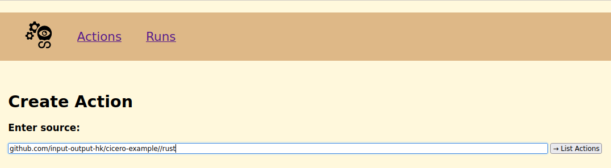

# Creating an Action in the Cicero-WebUI

## A first visit

After all steps from the [installation](./installation.md) a visit to [http://localhost:8000](http://localhost:8000) should show the following UI:


The first visit should also change the url to: [http://localhost:8000/action/current?active](http://localhost:8000/action/current?active)

## Click on "Create New Action"
After clicking the "Create New Action" button the browser-url should change to:
[http://localhost:8000/action/new](http://localhost:8000/action/new)

And the UI should correspond to:


### Add required team to repository
Cicero will use specific credentials to clone the repository from Github.
Therefore the following team 'input-output-hk/devops' needs to be added to the repository used in the next section.

### Enter the path to the Actions, which should be created

First the project needs a [flake.nix](https://github.com/input-output-hk/tullia-example/blob/main/rust/flake.nix) containing **tullia** Actions, see [Repository layout](./tullia-1.md).

**For any url the 'https://' part needs to be omitted.**

The path to the Actions can be a remote path like [github.com/input-output-hk/tullia-example](github.com/input-output-hk/tullia-example)
or a local path like [/home/developer/IOHK/tullia-example](/home/developer/IOHK/tullia-example/).

**Please note:**

The actual [flake.nix](https://github.com/input-output-hk/tullia-example/blob/main/rust/flake.nix) in this example resides in a subdirectory.

Therefore the URL needs to be adapted to respect [go-getter subdirectories](https://github.com/hashicorp/go-getter#subdirectories):
```
github.com/input-output-hk/tullia-example//rust
```
It's also possible to refer to a specific commit by using:
```
github.com/input-output-hk/tullia-example//rust?ref=yourCommitHash
```

### Assume a valid path or url was entered

It would look like this:

#TODO


### Click on "List Actions"

Clicking "List Actions" will start the cicero-evaluator, so the Actions are syntactically evaluated and listed:

#TODO


If an error occurs while evaluating Cicero will print the error in it's logs but also will show an error in the WebUI.

### Click on the "rust/build" Action

Clicking on "rust/build" will create the corresponding Action in Cicero:

#TODO


Please note that this Action hasn't run yet, which is also indicated by the "Runs" table at the bottom.

How to run the actual Action is explained in the [following chapter](./tullia-5.md).
