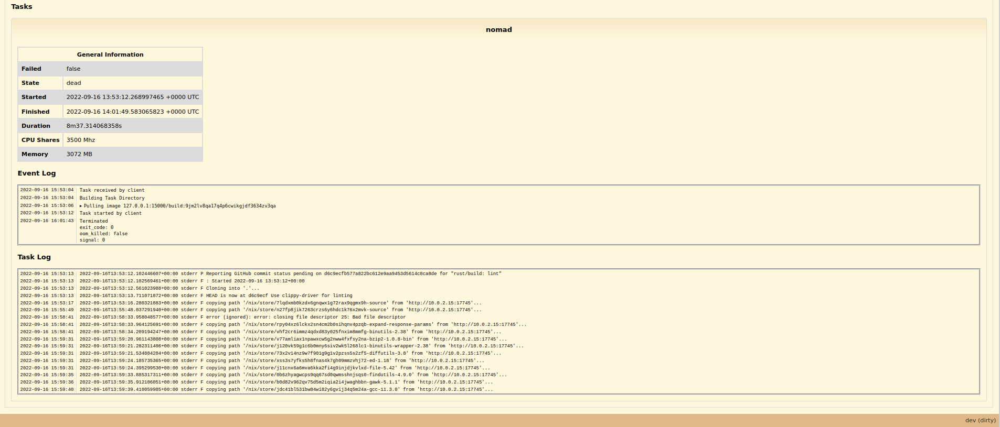

# Starting an Action in the Cicero-WebUI
The previous chapter explained how to create a Cicero Action.

Now the next step is to explain how to actually start this Action.

## Enter the Cicero development shell

```
nix develop
```
## Use httpie to create a new Fact


The creation or update of Facts will trigger the corresponding Actions to run in Cicero.

A fact can have multiple inputs for providing different arguments for calling the actual Action.

### Construct "rust/build" Fact
This will trigger the run of the "rust/build" Action.

Pick the commit hash which the build should run for.

```
cat > /tmp/rust-build.json <<EOF
{
  "github_event": "push",
  "github_body": {
    "ref": "refs/heads/main",
    "repository": {
      "full_name": "input-output-hk/tullia-example",
      "default_branch": "main"
    },
    "deleted": false,
    "base_ref": null,
    "head_commit": {
      "id": "d6c9ecfb577a822bc612e9aa9453d5614c8ca8de"
    }
  }
}
EOF
```

### Send HTTP Post to Cicero-API

By sending a HTTP POST request via httpie to the Cicero-API "/api/fact" endpoint the Fact gets created or updated.

```
http -v post :8000/api/fact < /tmp/rust-build.json
```

**Note:**

The OpenAPI v3 schema of the Cicero-API is available here:
- [localhost:8000/documentation/cicero.json](localhost:8000/documentation/cicero.json)
- [localhost:8000/documentation/cicero.yaml](localhost:8000/documentation/cicero.yaml)

## Go to "Runs" tab in Cicero WebUI: [http://localhost:8000/run](http://localhost:8000/run)

This page will provide the exact details how long it took to run the actual Action when it was triggered by the creation of the new fact.


## If there is more interest on how the corresponding task was scheduled on Nomad, follow the link under "Nomad Job ID":

#### Inputs, Facts & Task Groups


#### Tasks & Log


