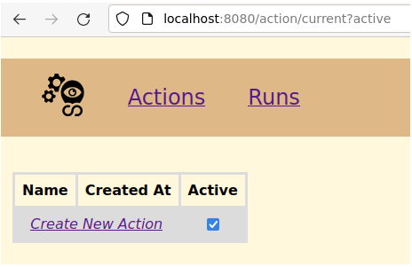
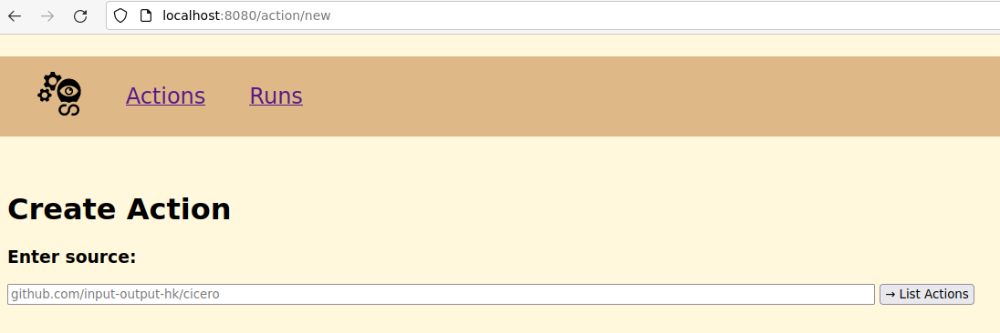
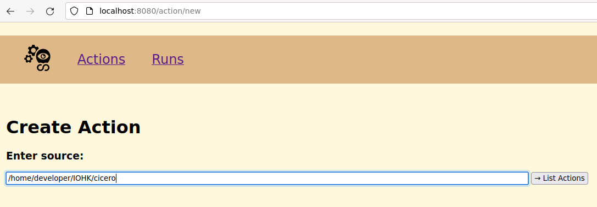
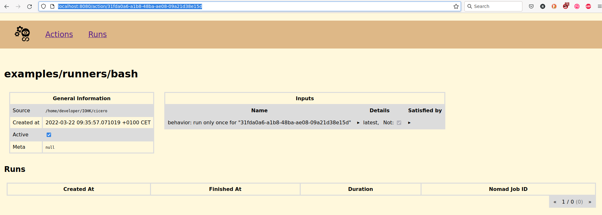

# How to create an Action

## A first visit

After all steps from the [installation](./installation.md) are running a visit to [http://localhost:8000](http://localhost:8000) should show the following UI:

The first visit should also change the url to: [http://localhost:8000/action/current?active](http://localhost:8000/action/current?active)

## Click on "Create New Action"
After clicking the "Create New Action" button the url should change to:
[http://localhost:8000/action/new](http://localhost:8000/action/new)

And the UI should correspond to:

## Enter the path to the Actions, which should be created

**For any url the 'https://' part needs to be omitted.**

The path to the Actions can be a remote path like [github.com/input-output-hk/cicero](github.com/input-output-hk/cicero)
or a local path like [/home/developer/IOHK/cicero](/home/developer/IOHK/cicero).

**This doesn't need to be a path to Cicero itself:**

Cicero Actions can also be part of a repository, which isn't Cicero.
See [How to include external actions](./how-to-include-external-actions.md) for more information.

### Assume the following path was entered:

### Click on "List Actions"

Clicking "List Actions" will start the cicero-evaluator, so the Actions are syntactically evaluated and listed:

If an error occurs while evaluating Cicero will print the error in it's logs but also will show an error in the WebUI.

### Click on the "examples/runners/bash" Action

Clicking on "examples/runners/bash" will create the corresponding Action in Cicero:

Please note that this Action hasn't run yet, which is also indicated by the "Runs" table at the bottom.
