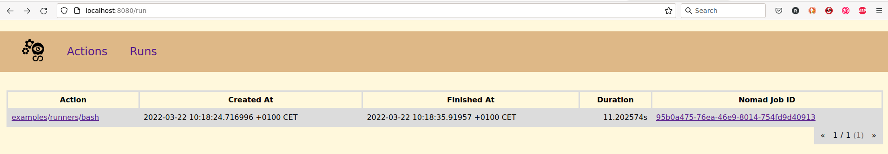
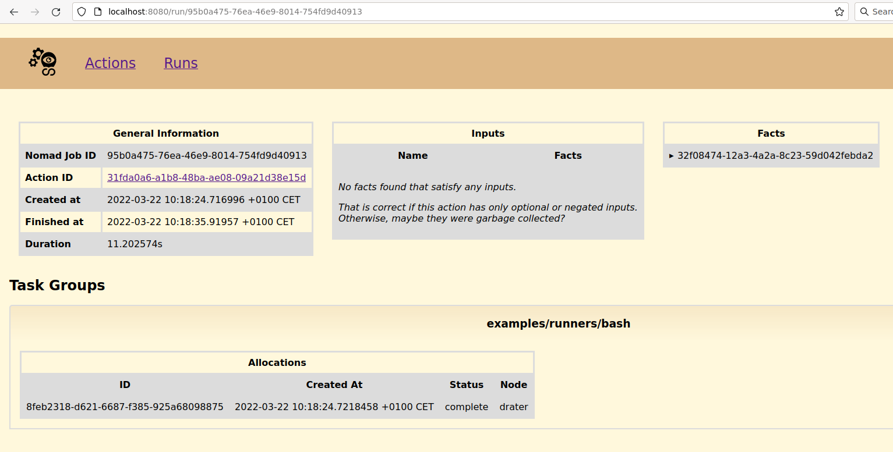

# How to start an Action
The last chapter explained how to create a Cicero Action.

Now it makes sense explain how to actually start this Action.

## Enter the Cicero development shell

```
nix develop
```

## Create json representation of the fact

A fact can have multiple inputs for providing different arguments for calling the actual Action.

But in fact the examples/runners/bash doesn't really need any of those inputs for the moment.
```
cat > /tmp/bash-fact.json << EOF
{
}
EOF
```

## Use httpie to create a new Fact
The creation or update of Facts will trigger the corresponding Actions to run in Cicero.

```
http -v POST :8000/api/fact "examples/runners/bash":=@/tmp/bash-fact.json
```

## Go to "Runs" tab in Cicero WebUI: [http://localhost:8080/run](http://localhost:8080/run)

This page will provide the exact details how long it took to run the actual Action when it was triggered by the creation of the new fact.



If there is more interest on how the corresponding task was scheduled on Nomad, follow the link under "Nomad Job ID":


