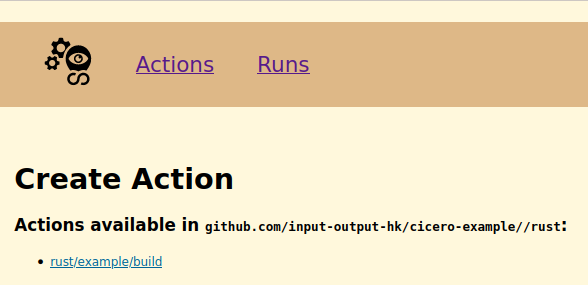

# How to include external Actions

Now an [example rust project](https://github.com/input-output-hk/cicero-example/tree/main/rust) is used, to explain how to setup an external repository with Cicero.

We will call this an external Action, because the Action will be provided by a repository which isn't the Cicero repository itself.

First the repository needs a [flake.nix](https://github.com/input-output-hk/cicero-example/blob/main/rust/flake.nix) containing **Cicero** itself as flake input and **ciceroActions** as flake output.

## flake.nix:
```nix
{
  description = "Flake for Cicero rustExample";

  inputs = {
    nixpkgs.url = "github:NixOS/nixpkgs/nixpkgs-unstable";
    utils.url = "github:numtide/flake-utils";
    cicero = {
      url = "github:input-output-hk/cicero";
      inputs.nixpkgs.follows = "nixpkgs";
    };
  };

  outputs = { self, nixpkgs, utils, cicero }:
    utils.lib.eachDefaultSystem (system:
      let
        pkgs = nixpkgs.legacyPackages.${system};
      in
      {
        defaultPackage = pkgs.stdenv.mkDerivation {
          name = "rustExample";
          src = ./src;
          buildInputs = with pkgs; [
            coreutils
            gcc
            rustc
          ];
          installPhase = ''
            rustc $src/hello.rs
            mkdir -p $out
            mv ./hello $out
          '';
        };
      }) // {
        ciceroActions = cicero.lib.callActionsWithExtraArgs
          rec {
            inherit (cicero.lib) std;
            inherit (nixpkgs) lib;
            actionLib = import cicero/lib.nix { inherit cicero lib; };
            nixpkgsRev = nixpkgs.rev;
          } ./cicero/actions;
      };
}
```

## Writing the external Action

Now it's required to write the corresponding Action for Cicero to execute later on.

The ciceroActions already hints that it does a recursive lookup in the ./cicero folder, so therefore it's possible to place our Action under the ./cicero/actions/rust/example directory.

### ci.nix
The Action itself is written as nix expression.

```
// Those are the inputs to the actual Action function
// The path of the file from the starting directory is used as name.
// std, lib & actionLib are provided by the set/rec in the ciceroActions flake output.
{ name, std, lib, actionLib, ... } @ args:

{

  // The inputs.start describes the expected Fact as json input
  // expecting sha & clone_url as fields
  // while statuses_url, ref & default_branch being optional fields
  inputs.start = ''
    "rust/example": start: {
      ${actionLib.common.inputStartCue}
    }
  '';

  // The output describes the published state of a Fact
  // A published Fact can either be successful or failed
  // and distinguishes from a normal Fact by having a run_id
  // It will also be stored in the Fact table in Cicero db
  // after a Run has completed
  output = { start }:
    actionLib.common.output args
      start.value."rust/example".start;

  // The job describes, what is executed
  // when the Nomad task is created and run
  job = { start }:
    let start-value = start.value."rust/example".start; in

    // A chain allows to chain multiple functions
    // into one array.
    // The functions in the array are called consecutively
    std.chain args [

      // simpleJob just escapes the provided name
      // stores a set of {${name}.group.${name}.task.${name} = task;};
      // and calls the next job
      actionLib.simpleJob

      // wraps multiple steps
      // 1. report to the github status api
      // 2. creating a netrc template
      // 3. setting configuration for the nomad task
      (actionLib.common.task start-value)

      // git.clone actually starts to clone
      // the url provided by the input Fact
      (std.git.clone start-value)
      std.nix.install

      // runs the following cmds in a shell
      (std.script "bash" ''
        cd rust
        nix build .
      '')
    ];
}
```

## Create Action in WebUI

### Click on "List Actions"

**Please note:**

The actual [flake.nix](https://github.com/input-output-hk/cicero-example/blob/main/rust/flake.nix) we want to use resides in a Subdirectory.

Therefore the URL needs to be adapted to respect [go-getter Subdirectories](https://github.com/hashicorp/go-getter#subdirectories):
```
github.com/input-output-hk/cicero-example//rust
```


### Click on "rust/example/build"



## Create "rust/example" Fact

This will trigger the run of the "rust/example/build" Action.

Pick the commit hash which the build should run for.

```
cat > /tmp/rust-example.json <<EOF
{
    "start": {
    "clone_url":   "https://github.com/input-output-hk/cicero-example",
    "sha":         "desiredCommitHash"
    }
}
EOF

nix develop
http -v post :8000/api/fact "rust/example":=@/tmp/rust-example.json
```
