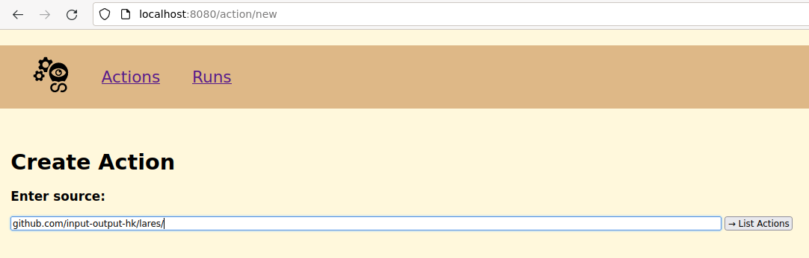
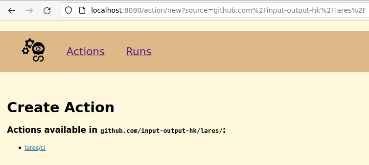

# How to include external Actions

In this example [lares](https://github.com/input-output-hk/lares) is used, to explain how to setup a external repository with Cicero.

We will call this an external Action, because the Action will be provided by a repository which isn't the Cicero repository itself.

First the repository needs a [flake.nix](https://github.com/input-output-hk/lares/blob/master/flake.nix) containing **Cicero** itself as flake input and **ciceroActions** as flake output.

## flake.nix:
```nix
{
  description = "Lares";

  inputs = {
    nixpkgs.url = "github:NixOS/nixpkgs/nixpkgs-unstable";
    utils.url = "github:numtide/flake-utils";
    cicero = {
      url = "github:input-output-hk/cicero";
      inputs.nixpkgs.follows = "nixpkgs";
    };
    nix2container.url = "github:nlewo/nix2container";
  };

  outputs = { self, nixpkgs, utils, cicero, nix2container, ... }:
    utils.lib.eachSystem [ "x86_64-linux" ]
      (system:
        let
          pkgs = nixpkgs.legacyPackages.${system}.extend self.outputs.overlay;
          n2c = nix2container.packages.${system}.nix2container;
        in
        rec {
  	   ...
  	   ...
     }) // rec {
  	   ...
  	   ...

       ciceroActions = cicero.lib.callActionsWithExtraArgs
         rec {
           inherit (cicero.lib) std;
           inherit (nixpkgs) lib;
           actionLib = import "${cicero}/action-lib.nix" { inherit std lib; };
         } ./cicero;
     };
}
```

## Writing the external Action

Now it's required to write the corresponding Action for Cicero to execute later on.

The ciceroActions already hints that it does a recursive lookup in the ./cicero folder, so therefore it's possible to place our Action under the ./cicero/lares directory.

### ci.nix
The Action itself is written as nix expression.

```
// Those are the inputs to the actual Action function
// The path of the file from the starting directory is used as name.
// std, lib & actionLib are provided by the set/rec in the ciceroActions flake output.
{ name, std, lib, actionLib, ... } @ args:


{

  // The inputs.start describes the expected Fact as json input
  // expecting sha & clone_url as fields
  // while statuses_url, ref & default_branch being optional fields
  inputs.start = ''
    "${name}": start: {
      // from both std/ci/{pr,push}
      sha: string
      clone_url: string
      statuses_url?: string

      // only from std/ci/push
      ref?: "refs/heads/\(default_branch)"
      default_branch?: string
    }
  '';

  // The output describes the published state of a Fact
  // A published Fact can either be successful or failed
  // and distinguishes from a normal Fact by having a run_id
  // It will also be stored in the Fact table in Cicero db
  // after a Run has completed
  output = { start }:
    let cfg = start.value.${name}.start; in
    {
      success.${name} = {
        ok = true;
        revision = cfg.sha;
      } // lib.optionalAttrs (cfg ? ref) {
        inherit (cfg) ref default_branch;
      };
    };

  // The job describes, what is executed
  // when the Nomad task is created and run
  job = { start }:
    let cfg = start.value.${name}.start; in

    // A chain allows to chain multiple functions
    // into one array.
    // The functions in the array a called consecutively
    std.chain args [

      // simpleJob just escapes the provided name
      // stores a set of {${name}.group.${name}.task.${name} = task;};
      // and calls the next job
      actionLib.simpleJob

      // reportStatus tries to report to the github status api
      // if a statuses_url is available
      (std.github.reportStatus cfg.statuses_url or null)

      // the template set creates a netrc file
      // inside the Nomad Task
      {
        template = std.data-merge.append [{
          destination = "secrets/netrc";
          data = ''
            machine github.com
            login git
            password {{with secret "kv/data/cicero/github"}}{{.Data.data.token}}{{end}}
          '';
        }];
      }

      // git.clone actually starts to clone
      // the url provided by the input Fact
      (std.git.clone cfg)

      // the resources set is used
      // for configuring the Nomad Task
      {
        resources = {
          cpu = 3000;
          memory = 1024 * 3;
        };
      }

      // nix.build actually runs the nix build of the flake.nix
      std.nix.build


      // another template set, which is used for storing
      // docker credentials in the Nomad Task
      {
        env.REGISTRY_AUTH_FILE = "/secrets/auth.json";

        template = std.data-merge.append [{
          destination = "secrets/auth.json";
          data = ''{
            "auths": {
              "docker.infra.aws.iohkdev.io": {
                "auth": "{{with secret "kv/data/cicero/docker"}}{{with .Data.data}}{{base64Encode (print .user ":" .password)}}{{end}}{{end}}"
              }
            }
          }'';
        }];
      }

      // this bash script will actually execute
      // a specific flake output, which
      // creates and pushes a docker image to a registry
      (std.script "bash" ''
        set -x
        nix run .#laresImage.copyToRegistry
      '')
    ];

```

## Create Action in WebUI

Click on "List Actions"



Click on "lares/ci"



## Create "lares/ci" Fact

This will trigger the run of the "lares/ci" Action.

Pick the commit hash a docker image should be created for.

```
cat > /tmp/lares-fact.json <<EOF
{
    "start": {
	"clone_url":   "https://github.com/input-output-hk/lares",
	"sha":         "desiredCommitHash"
    }
}
EOF

nix develop
http -v post :8000/api/fact "lares/ci":=@/tmp/lares-fact.json
```
